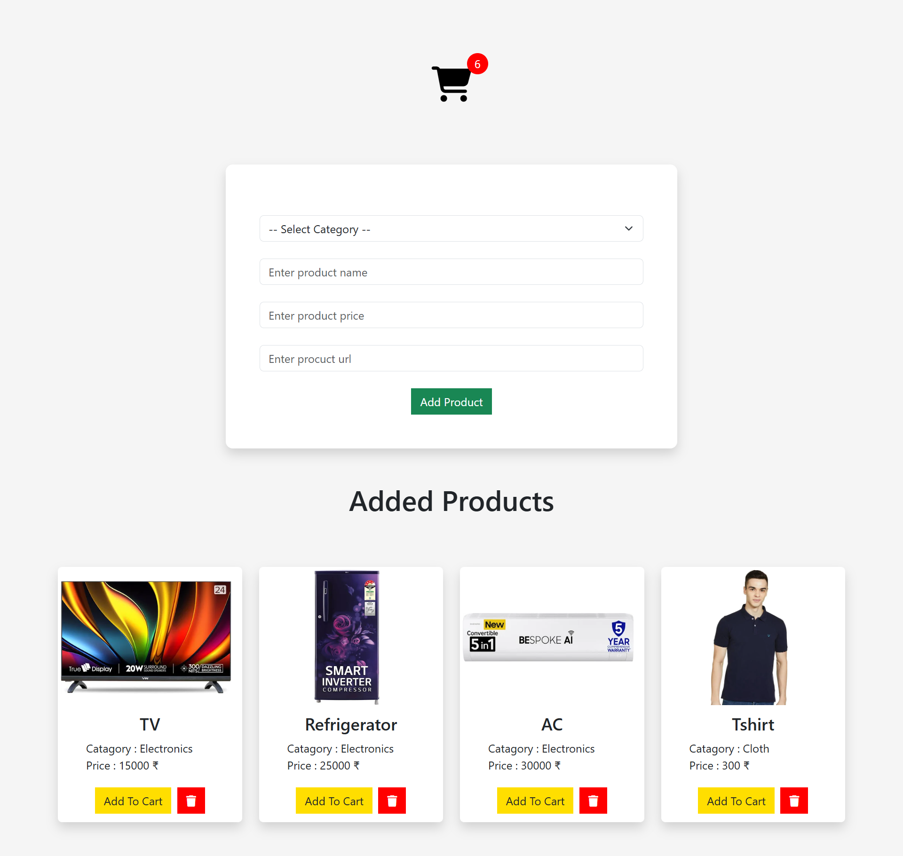
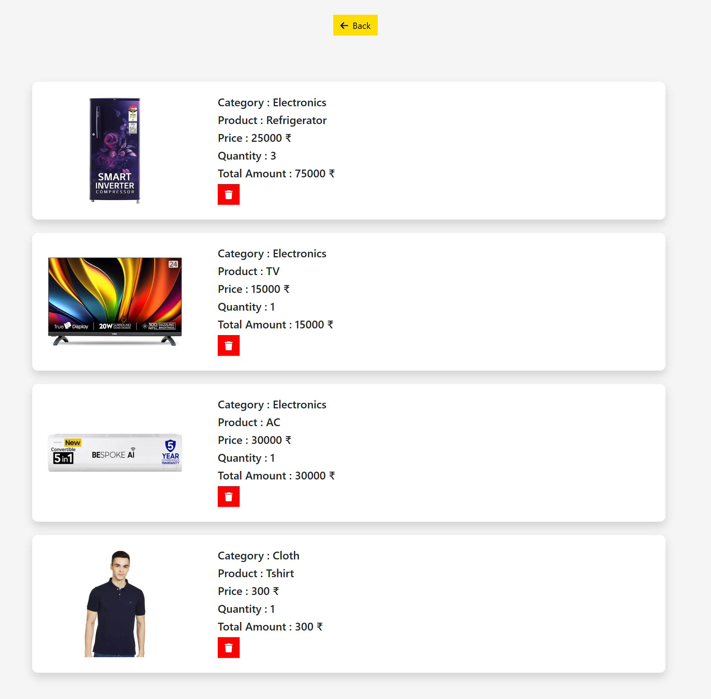

# 📁Add to Cart - Simple E-commerce Functionality :

A simple project demonstrating basic e-commerce functionality "Add to Cart", built using HTML, CSS, Bootstrap, and JavaScript. The project uses LocalStorage to store product and cart data, allowing the data to persist even after page reloads.

## ✨ Features :

- ✅ Add products with **Category**, **Name**, and **Price**
- 🗑️ Delete products from the main product list
- ➕ Add products to a cart
- 🛍️ View cart on a **separate page**
- ❌ Remove products from the cart
- 💾 All data is stored in the **browser’s LocalStorage**

## 🧰 Technologies Used :

- **HTML5** – Markup structure  
- **CSS3** – Custom styling  
- **Bootstrap 5** – Responsive layout and components  
- **JavaScript (ES6)** – App logic and interactivity  
- **LocalStorage API** – Persistent data storage without a backend

## 🚀 How It Works :

 1) On the main page, users can add product details (category, name, price).
 
 2) Products are listed dynamically with options to delete or add to cart.
 
 3) The cart page shows only the products added to the cart.
 
 4) Users can also remove products from the cart.
 
 5) All changes reflect in LocalStorage in real-time. 

 ## 📸 Project Preview :

 ## Cart Page :

